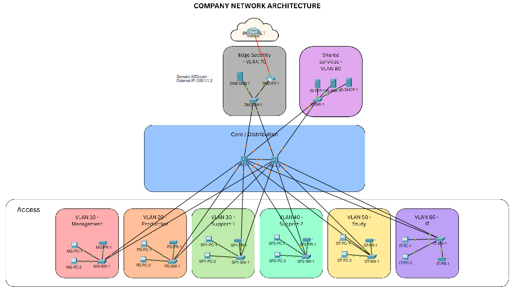

# Project 1 — Secure Network Design & Simulation

> **BeCode Corp. — Network Infrastructure Project**  
> Team challenge | Duration: 7 days | Deadline: 01/03/2026

---

## Overview

This project involved designing and simulating a secure, segmented enterprise network for BeCode Corp.'s new office. 
The goal was to produce a functional Packet Tracer simulation backed by structured documentation, with a focus on security, VLAN segmentation, access control, and redundancy.
The network covers 6 operational departments plus a DMZ and an internal server zone, connected through a redundant dual-L3-switch core and secured with ACLs, AAA authentication, and a physically isolated DMZ router.

---

## Repository Contents

```
01-network-simulation/
├── Assets/
│   ├── Network_topology.pkt           # Cisco Packet Tracer simulation file
│   ├── Network_topology.png           # Network topology screenshot
│   ├── IP_table.xlsx                  # IP addressing table overview
│   └── Device_interfaces.xlsx         # Defice interface configurations
└── Configuration_files/			   # IOS configuration files of the networking equipment
    ├── Border Router - DMZ-RT-1.ios
    ├── Central Switch - VS-1-1.ios
    ├── Central Switch - VS-1-2.ios
    ├── VLAN 10 - Switch - MG-SW.ios
    ├── VLAN 20 - Switch - PD-SW-1.ios
    ├── VLAN 30 - Switch - SP1-SW-1.ios
    ├── VLAN 40 - Switch - SP2-SW-1.ios
    ├── VLAN 50 - Switch - ST-SW-1.ios
    ├── VLAN 60 - Switch - IT-SW-1.ios
    ├── VLAN 70 - Switch - DMZ-SW-1.ios
    └── VLAN 80 - Switch - IS-SW-1.ios
```

---

## Network Topology

The network uses a **hub-and-spoke VLAN architecture** with a redundant dual-L3-switch core (VS-1-1 and VS-1-2). Each department connects to the core via its own access switch, assigned to a dedicated VLAN. 
Internet-facing traffic exits through a border router (DMZ-RT-1) connected to a simulated ISP via a serial link.



---

## VLAN & IP Addressing

| VLAN | Segment | Subnet | Gateway (VS-1) | Devices |
|------|---------|--------|----------------|---------|
| 10 | Management | 192.168.1.0/27 | 192.168.1.1 | 5 workstations, 1 printer, 1 switch |
| 20 | Production | 192.168.1.32/27 | 192.168.1.33 | 10 workstations, 1 printer, 1 switch |
| 30 | Support-1 | 192.168.1.64/27 | 192.168.1.65 | 10 workstations, 1 printer, 1 switch |
| 40 | Support-2 | 192.168.1.96/27 | 192.168.1.97 | 10 workstations, 1 printer, 1 switch |
| 50 | Study | 192.168.1.128/27 | 192.168.1.129 | 8 workstations, 1 printer, 1 switch |
| 60 | IT Department | 192.168.1.160/27 | 192.168.1.161 | 5 workstations, DHCP server, AAA server, 1 printer |
| 70 | DMZ | 192.168.1.192/28 | 192.168.1.197 | Border router (DMZ-RT-1), DNS server |
| 80 | Internal Servers | 192.168.1.208/28 | 192.168.1.209 | AAA server, DHCP server, FTP server |

All workstations receive addresses via DHCP. Static IPs are assigned to infrastructure devices, servers, and printers.

---

## Core Infrastructure

### Redundant Core Switches (VS-1-1 / VS-1-2)
The network core uses two L3 switches in a redundant configuration. Every access switch and the DMZ switch connect via trunk ports to both core switches, 
ensuring no single point of failure at the aggregation layer.

### Services
| Service | Device | Location |
|---------|--------|----------|
| DHCP | IS-DHCP-1 + IT-DHCP-1 | VLAN 80 / VLAN 60 |
| DNS | DMZ-DNS-1 | VLAN 70 (DMZ) |
| FTP | IS-FTP-1 | VLAN 80 |
| AAA | IS-AAA-1 + IT-AAA-1 | VLAN 80 / VLAN 60 |

### DMZ
The DMZ (VLAN 70) is physically separated from the internal network through a dedicated border router (DMZ-RT-1). 
This router connects to the simulated ISP via a serial interface and to the internal DMZ switch via a Gigabit port. 
The DNS server sits in the DMZ to handle name resolution for externally reachable services.

---

## Security Implementation

### VLAN Segmentation
Each department is isolated in its own VLAN. Inter-VLAN routing is controlled at the L3 switch level, 
ensuring that traffic between departments passes through the core where ACLs are enforced.

### ACLs (Access Control Lists)
ACLs are applied on the L3 core switches to restrict inter-department communication. 
Each VLAN only has access to the services it requires. Sensitive zones (Internal Servers, DMZ) are not reachable from department VLANs by default.

### AAA Authentication
Both an internal AAA server (VLAN 80) and a departmental AAA server (VLAN 60) are deployed to handle device authentication. 
All managed switches and routers are configured to authenticate privileged access through AAA.

### Hardened Device Configuration
- All unused switch ports are administratively shut down
- Trunk links are explicitly configured (no DTP auto-negotiation)
- Privileged EXEC and local admin passwords are set on every device
- Password complexity enforced across all managed devices

### Printers
Each department VLAN includes a statically addressed printer, keeping print traffic isolated within the VLAN and preventing cross-department access.

---

## Tools & Technologies

- **Cisco Packet Tracer** — network simulation
- **VLANs** — layer 2 segmentation
- **ACLs** — inter-VLAN access control
- **DHCP / DNS / FTP / AAA** — service infrastructure
- **Trunk / Access port configuration** — IOS CLI

---

## Skills Demonstrated

- Enterprise network design from requirements to simulation
- IP addressing and subnetting
- VLAN configuration and inter-VLAN routing
- DMZ architecture using a dedicated border router
- Network security: ACLs, AAA, port hardening
- Documentation: IP table, device interface mapping, cost estimation