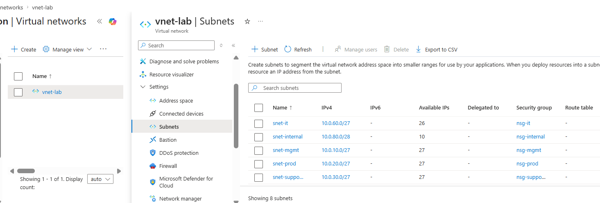
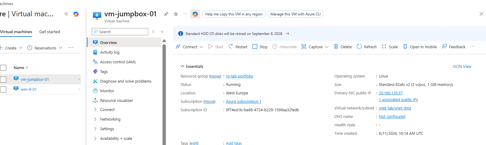
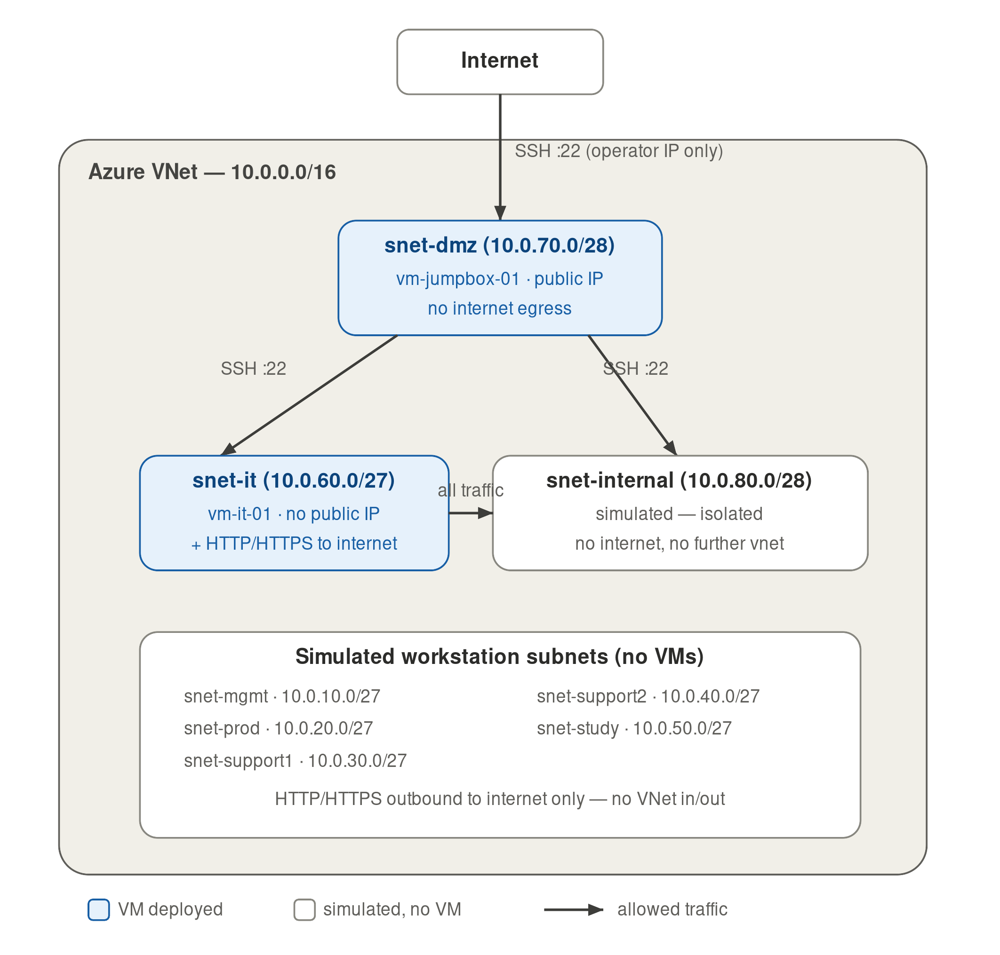
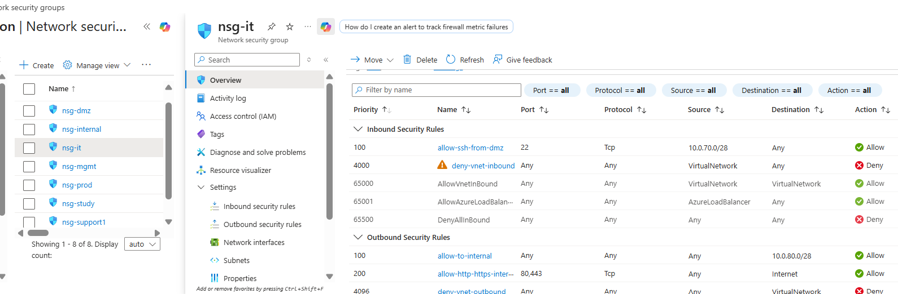
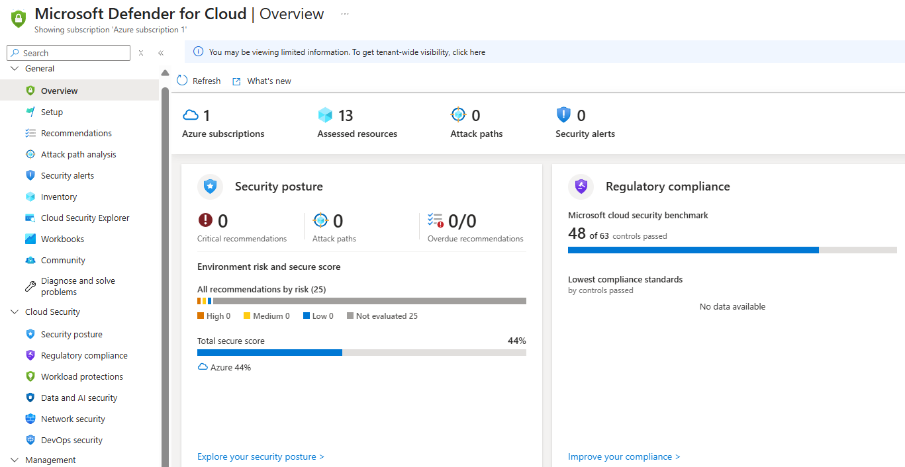
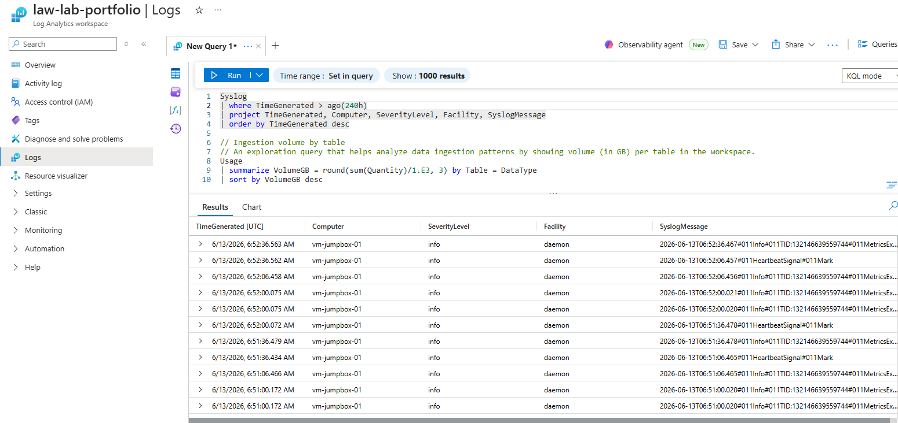

# Azure network implementation project - Phase 1

In phase one I have implemented the following;
- Core architecture of the network, main VNet and subnets
- Two VMs simulating an internal server and the jumpbox in the DMZ
- Basic security with Network Security Groups and Microsoft Defender for Cloud
- Monitoring & logging via Log Analytics workspace
- Full infrastructure exported as Bicep template

## Architecture

Single VNet (`10.0.0.0/16`) with 8 subnets mirroring a real corporate VLAN structure:

| Subnet | CIDR | VLAN equivalent | Status |
|---|---|---|---|
| `snet-mgmt` | 10.0.10.0/27 | Management (executives) | Simulated |
| `snet-prod` | 10.0.20.0/27 | Production workstations | Simulated |
| `snet-support1` | 10.0.30.0/27 | Support team 1 | Simulated |
| `snet-support2` | 10.0.40.0/27 | Support team 2 | Simulated |
| `snet-study` | 10.0.50.0/27 | Study/training | Simulated |
| `snet-it` | 10.0.60.0/27 | IT administrators | ⭐ VM deployed |
| `snet-dmz` | 10.0.70.0/28 | Public-facing / jump box | ⭐ VM deployed |
| `snet-internal` | 10.0.80.0/28 | Internal servers | Simulated |

<details>
<summary>Show screenshot of Azure subnets</summary>



</details>

## Virtual Machines

Initially only two VMs will be simulated for cost-efficiency reasons:
- **vm-jumpbox-01** — Ubuntu 24.04 LTS, snet-dmz, public IP, SSH key authentication only
- **vm-it-01** — Ubuntu 24.04 LTS, snet-it, no public IP, reachable only via jump box
- Both VMs: Standard HDD, auto-shutdown at 19:00 UTC, password authentication disabled

<details>
<summary>Show screenshot of Azure virtual machines</summary>



</details>

## Network security

- All VMs use SSH key pairs
- All SSH access enters through vm-jumpbox-01 in the DMZ, with inbound rules restricted to operator IP
- Dynamic IP update script for operators working from changing locations
```bash
az network nsg rule update \
  --resource-group rg-lab-portfolio \
  --nsg-name nsg-dmz \
  --name allow-ssh-from-current-ip \
  --source-address-prefixes $(curl -s https://api.ipify.org)
```
- 8 Network Security Groups (NSGs), one per subnet, enforcing least-privilege inter-subnet communication
- NSGs verified with Network Watcher

<details>
<summary>Show network diagram</summary>



</details>
<details>
<summary>Show screenshot of Azure NSGs</summary>



</details>

## Security Controls

- Microsoft Defender for Cloud - Plan 1 (threat detection, vulnerability assessment)
- Vulnerability assessment via Microsoft Defender Vulnerability Management (agentless)
- Endpoint protection via Defender for Endpoint integration

</details>
<details>
<summary>Show screenshot of Microsoft Defender for Cloud</summary>



</details>

## Monitoring & logging

- Log Analytics workspace (law-lab-portfolio, PerGB2018 tier)
- Azure Monitor Agent deployed via Data Collection Rule
- Syslog forwarding from both VMs to Log Analytics
- Verified log ingestion via KQL queries

</details>
<details>
<summary>Show screenshot of Log Analytics workspace</summary>



</details>

## Infrastructure as Code

- Infrastructure exported as ARM template via `az group export`
- ARM template decompiled to Bicep -> circular dependency errors from 
  duplicate NSG rule definitions required a clean hand-written rewrite
- Final [main.bicep](./main.bicep) is parameterized and free of auto-generated noise

